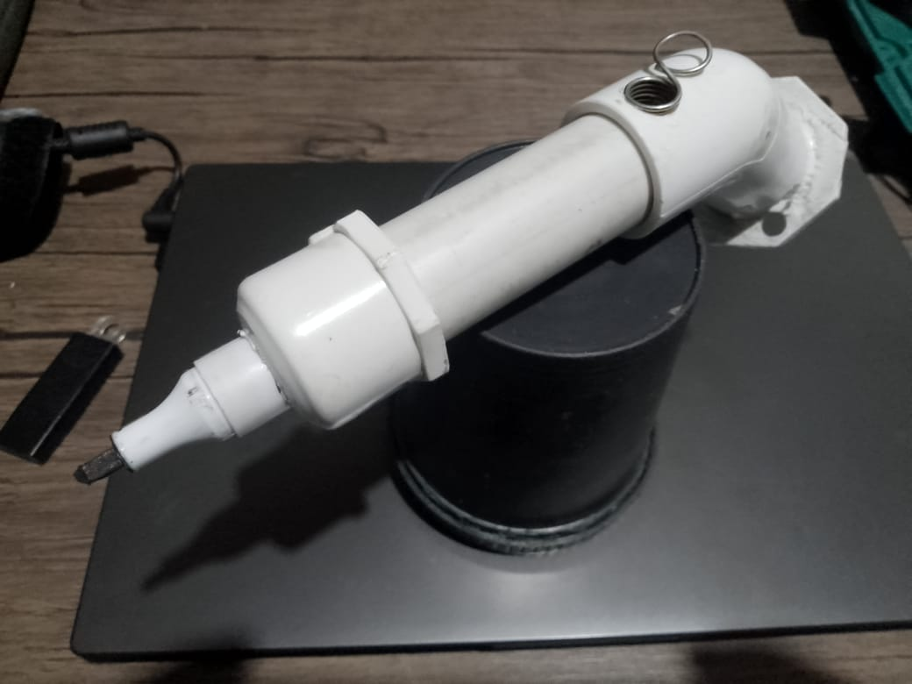
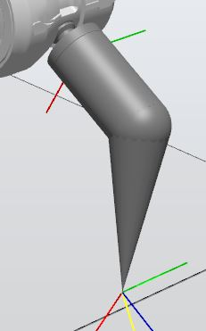
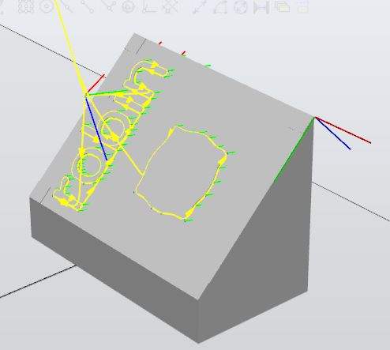

# robotica-2023-2-laboratorio-1
en este laboratorio se desarrola la guia de laboratorio # 1, en donde se piden dos trayectorias, una con el nombre de los integrantes del equipo y otra con una decoracion, estas trayectorias se hacen para una herramienta diseñada por el equipo que soporta un marcador que deja evidencia sobre una hoja de papel del resultado obtenido. 
## Herramienta
Se fabrico con un marcador borrable y accesorios de tuberia PVC, teniendo en cuenta las medidas de la brida del robot IRB140 y no se hizo un modelo CAD, en cambio se uso el metodo de detectar fisicamente el TCP de la herramienta con el robot, luego de hacer esta calibracion del teach pendant se copiaron las coordenadas x,y,z de la herramienta respecto al robot y luego en RobotStudio con la opcion crear herramienta se digitaron dichas coordenadas con un peso y centro de masa aproximados, lo que resulta en que a partir de esos datos RobotStudio genera automaticamente un modelo CAD simplificado de la herramienta.

## Tablero como workobject
El marcador debia escribir en una hoja pegada en un tablero, esto se logra creando en RobotStudio un workobject con las dimensiones de la hoja donde se va a eescribir, este workobject va a tenener los puntos que describen la trayectoria que debe seguir el TCP de la herramienta para lograr escribir, para cada uno de esos puntos (robotargets) hay que definir aparte de su posicion en el workobject, la orientacion con que la herramienta se va a orientar cuando llegue, hay que ser cuidadoso de configurar esta orientacion de manera que evite las indeterminaciones cuando describe la trayectoria de escritura. 

## Prueba con el robot real
Luego de cargar el codigo RAPID generado en RobotStudio, se hace la deteccion de tres puntos del workobject con la herramienta, primero se hace un paso a paso para asegurar que el brazo llegue a todos los puntos de la trayectoria sin problemas como se ve en el video de escritura en posicion horizontal.

luego se le da la orden al robot de que haga la trayectoria completa como se ve en el video con el workobject en posicion inclinada
[I'm an inline-style link](https://youtu.be/Gnh0GfuLM-Y)

